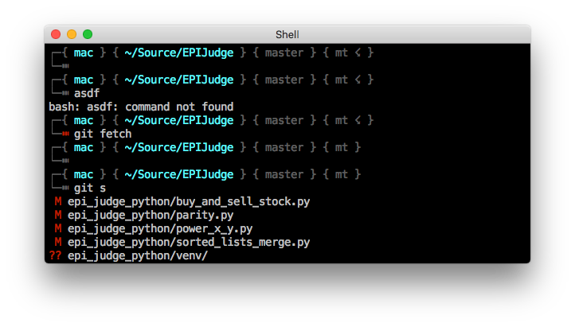

## Bash prompt with git info



A simple and beautiful bash prompt that also prints some git information, without any other bells and whistles.

- Shows if a git fetch has not been run for 15 minutes with `☇` character
- Summarizes git status with single letters
- Shows number of ahead / behind commits with remote branch
- Shows the current branch
- Username included in red if running as root
- Highlights the prompt with a red `⑉` if the exit status of a command > 0
- Configurable host nickname

### Install

```bash
git clone https://github.com/chkhd/bash-prompt ~/.bash-prompt

echo 'MY_HOST_NICKNAME=whateveryoulike' >> ~/.bashrc
echo 'source ~/.bash-prompt/bash-prompt.sh' >> ~/.bashrc
```


### Support

I use this regularly on MacOS and Linux with latest Bash and Git, no plans to support anything ancient but if you run into issues with recent versions please open an issue.


### License

Copyright 2019 David Chkhikvadze

Permission is hereby granted, free of charge, to any person obtaining a copy of this software and associated documentation files (the "Software"), to deal in the Software without restriction, including without limitation the rights to use, copy, modify, merge, publish, distribute, sublicense, and/or sell copies of the Software, and to permit persons to whom the Software is furnished to do so, subject to the following conditions:

The above copyright notice and this permission notice shall be included in all copies or substantial portions of the Software.

THE SOFTWARE IS PROVIDED "AS IS", WITHOUT WARRANTY OF ANY KIND, EXPRESS OR IMPLIED, INCLUDING BUT NOT LIMITED TO THE WARRANTIES OF MERCHANTABILITY, FITNESS FOR A PARTICULAR PURPOSE AND NONINFRINGEMENT. IN NO EVENT SHALL THE AUTHORS OR COPYRIGHT HOLDERS BE LIABLE FOR ANY CLAIM, DAMAGES OR OTHER LIABILITY, WHETHER IN AN ACTION OF CONTRACT, TORT OR OTHERWISE, ARISING FROM, OUT OF OR IN CONNECTION WITH THE SOFTWARE OR THE USE OR OTHER DEALINGS IN THE SOFTWARE.
